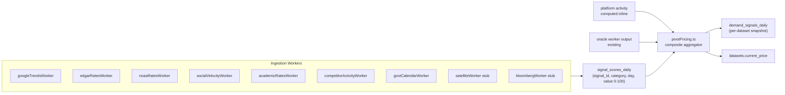

## 0. Implementation location (audit 2026-05-09)

This plan was authored for a `backend/` tree under **CapitalOS**, not `nil-project`. The checklist below matches **`c:\Users\evanl\Downloads\datapulse\CapitalOS`**. See also the updated session plan `datapulse_session_focus_0e1bb5e0.plan.md` in your global `.cursor/plans/`.

**Divergence from §4 snippet in this doc:** live `GUIDE_WEIGHTS` uses `oracle: 0.18` and `bloomberg: 0.02` (FRED), not `oracle: 0.20` / `bloomberg: 0.00`. `fredOracleWorker` exists in addition to the original oracle pipeline.

## 1. Current state (audit)

**Historical note (pre-implementation):** The paragraphs below described the codebase *before* the 10-signal work. As of §0, CapitalOS implements the full backend design; relative paths like `backend/src/...` refer to files under `c:\Users\evanl\Downloads\datapulse\CapitalOS`, not this nil-project workspace.

The pricing engine ([backend/src/pricing/pivotPricing.ts](backend/src/pricing/pivotPricing.ts)) was previously hardcoded to 2 signals: `platform` (40%) and `oracle` (20%), normalized to sum to 1. Per the PivotGuide_v4 weight table, 8 signals were missing. The oracle pipeline workers ([backend/src/workers/](backend/src/workers/)) — NOAA, GDELT, SEC EDGAR, Reuters, WHO, plus LLM classifier and consensus correlator — fed the oracle slot through `repriceAll`/`repriceOneByCategory` calls. The Supabase schema ([backend/supabase/pivot_2026_04.sql](backend/supabase/pivot_2026_04.sql)) stored per-dataset/per-day composite snapshots in `demand_signals_daily` with only 2 signal columns until `pivot_signals_2026_05.sql`.

What the original plan did NOT touch: changing core oracle worker behavior, the consensus correlator, contracts dir, the 40% platform signal shape.

## 2. Architecture




Per-category scores live in `signal_scores_daily`; the pricing engine joins them to each dataset's `category` at compute time. This decouples signal generation cadence (hourly/daily/weekly) from price recompute cadence.

## 3. Schema migration

New file [backend/supabase/pivot_signals_2026_05.sql](backend/supabase/pivot_signals_2026_05.sql):

```sql
create table if not exists signal_scores_daily (
  seq        bigserial primary key,
  signal_id  text not null,
  category   text not null,        -- '*' = global, else Dataset.category
  day        date not null,
  value      double precision not null default 0,
  updated_at timestamptz not null default now(),
  unique (signal_id, category, day)
);
create index if not exists idx_signal_scores_lookup
  on signal_scores_daily (signal_id, category, day desc);
alter table signal_scores_daily enable row level security;
create policy "read_signal_scores" on signal_scores_daily
  for select to anon, authenticated using (true);
```

Extend `demand_signals_daily` with one nullable column per signal so the per-dataset snapshot keeps the full breakdown for transparency:

```sql
alter table demand_signals_daily
  add column if not exists signal_google_trends double precision default 0,
  add column if not exists signal_edgar_rates   double precision default 0,
  add column if not exists signal_noaa_rates    double precision default 0,
  add column if not exists signal_social        double precision default 0,
  add column if not exists signal_academic      double precision default 0,
  add column if not exists signal_competitor    double precision default 0,
  add column if not exists signal_govt_cal      double precision default 0,
  add column if not exists signal_satellite     double precision default 0,
  add column if not exists signal_bloomberg     double precision default 0;
```

## 4. Refactor `pivotPricing.ts`

Replace the `{ platform, oracle }` weight pair with a 10-signal map. Key snippet:

```ts
export type SignalId =
  | "platform" | "oracle" | "google_trends" | "edgar_rates"
  | "noaa_rates" | "social" | "academic" | "competitor"
  | "govt_cal" | "satellite" | "bloomberg";

export const GUIDE_WEIGHTS: Record<SignalId, number> = {
  platform: 0.40, oracle: 0.20, google_trends: 0.10,
  edgar_rates: 0.08, noaa_rates: 0.07, social: 0.05,
  academic: 0.04, competitor: 0.03, govt_cal: 0.02,
  satellite: 0.01, bloomberg: 0.00,
};
```

`compositeScore` takes `Record<SignalId, number>` (0–100 per signal). Weights are renormalized over signals that have a non-null value within the lookback window so the composite stays on a 0–100 scale even when a worker is offline. Conflict-resolution rule from the pivot guide stays: if internal `platform` ≥ 30 but external aggregate < 20, the composite is biased toward `platform` (documented in code, not just here).

Update `computeDatasetPricing` and `latestSnapshot` to fetch recent per-category scores via a new `store.getRecentSignalScores(category, lookbackDays)`.

## 5. Store interface additions

[backend/src/store/Store.ts](backend/src/store/Store.ts) adds:

```ts
upsertSignalScore(row: { signalId: SignalId; category: string; day: string; value: number }): Promise<void>;
getRecentSignalScores(category: string, days: number): Promise<Record<SignalId, number>>;
```

Memory + Supabase + DBStore implementations follow the same shape as `appendDemandSignal` / `latestDemandSignal`. Supabase guards on missing-table the same way the pivot tables do.

## 6. New ingestion workers (one per signal)

All workers follow the existing `startWorkerLoop` pattern from [backend/src/workers/oracleUtils.ts](backend/src/workers/oracleUtils.ts) and write to `signal_scores_daily` via `store.upsertSignalScore`. Each worker normalizes its raw measurement to 0–100 with a documented saturating curve.

Build order from the PivotGuide_v4: "Google Trends, SEC EDGAR, NOAA direct feed, social velocity, oracle rewire, then the rest."

- `**googleTrendsWorker.ts**` (10%) — uses `google-trends-api` npm package; polls daily; one query per category keyword (e.g. "weather data", "financial data"). Normalize the 0–100 returned by Google directly.
- `**edgarRatesWorker.ts**` (8%) — distinct from the existing oracle `edgarWorker.ts`. Polls EDGAR `/cgi-bin/browse-edgar?action=getcurrent&output=atom` to count 10-K, 10-Q, 8-K filings per hour; spike detection vs 30-day rolling baseline. Maps to the `Financial` category.
- `**noaaRatesWorker.ts**` (7%) — polls the same NOAA URL the oracle worker uses, but counts active alerts by severity instead of persisting events. Saturating curve: 0 alerts → 30, 5 alerts → 60, 20+ → 95. Maps to `Weather` and `Climate`.
- `**socialVelocityWorker.ts**` (5%) — Reddit-only initially (free official API, `https://www.reddit.com/r/{sub}/new.json`). Subreddit map per category (`r/wallstreetbets+r/finance` → Financial, `r/weather+r/tropicalweather` → Weather, etc.). Twitter/X and LinkedIn left behind `SOCIAL_TWITTER_BEARER`/`SOCIAL_LINKEDIN_TOKEN` env flags — return zero contribution if unset. Note in code: paid APIs deferred per pivot guide weight tolerance.
- `**academicRatesWorker.ts**` (4%) — arXiv API (`http://export.arxiv.org/api/query?search_query=cat:...&sortBy=submittedDate`) + Semantic Scholar (`api.semanticscholar.org/graph/v1/paper/search`). Weekly cadence per pivot guide. Counts new papers per category in the last 7 days vs a rolling 90-day baseline.
- `**competitorActivityWorker.ts**` (3%) — Ocean Protocol public subgraph (`https://v4.subgraph.oceanprotocol.com/subgraphs/name/oceanprotocol/ocean-subgraph` GraphQL) for listing/price changes. AWS Data Exchange has aggressive anti-scrape; this worker implements the Ocean side now and a documented stub for AWS that returns 0. Weekly cadence.
- `**govtCalendarWorker.ts**` (2%) — data.gov CKAN API + ONS API + Eurostat REST. Counts upcoming releases (GDP, CPI, employment) in the next 7 days as a forward-looking signal. Daily.
- `**satelliteWorker.ts**` (1%) — stub: writes `value: 0` daily and logs `[satellite] Phase 2 — pending Sentinel Hub / Planet Labs API agreement`. Reserves the weight slot.
- `**bloombergWorker.ts**` (0%) — stub: writes `value: 0`, weight `0.00`. Code present so swap-in is one config change when partnership lands.

## 7. Wire workers into [backend/src/server.ts](backend/src/server.ts)

After the existing oracle worker starts, add:

```ts
startGoogleTrendsWorker(store);
startEdgarRatesWorker(store);
startNoaaRatesWorker(store);
startSocialVelocityWorker(store);
startAcademicRatesWorker(store);
startCompetitorActivityWorker(store);
startGovtCalendarWorker(store);
startSatelliteWorker(store);
startBloombergWorker(store);
```

Each worker has its own poll cadence — no single shared scheduler.

## 8. Transparency surface

Update [backend/src/routes/transparency.ts](backend/src/routes/transparency.ts) so `/api/transparency/datasets/:id/signals` returns the per-signal breakdown (all 10 values) for the buyer-facing dashboard. Required by the pivot guide's price-transparency requirement: "demand score index (0–100), and category average price ... buyers can see exactly how the price has moved."

## 9. Decisions surfaced (please confirm or override in plan response)

- **Twitter/X and LinkedIn**: skipped now (paid / restricted access). Reddit covers the 5% social weight. Re-enable by setting env vars when access is provisioned.
- **Satellite (1%) and Bloomberg (0%)**: built as stub workers that occupy the slot and emit 0. No action needed when those partnerships close — just flip the body of the worker.
- **Per-signal cadence** matches the pivot guide ("Google Trends: daily; academic: weekly; oracle: near real-time").
- **Schema choice**: separate `signal_scores_daily` table (per-category, per-signal) plus extra columns on `demand_signals_daily` (per-dataset snapshot for transparency). The alternative of cramming everything into `demand_signals_daily` was rejected because most external signals are per-category, not per-dataset.

## 10. Testing checklist (manual)

- Run `pivot_signals_2026_05.sql` against staging Supabase; verify both new table + altered columns exist.
- Boot backend; confirm each worker logs its first poll without throwing.
- Hit `/api/transparency/datasets/DS-0142/signals` and verify all 10 signals are present.
- Confirm `composite` value drift on a Financial dataset after triggering a fake EDGAR spike (load test by lowering `EDGAR_RATE_BASELINE` env var).
- `WEEKLY_MOVEMENT_CAP_PCT=20` is still honored end-to-end.

